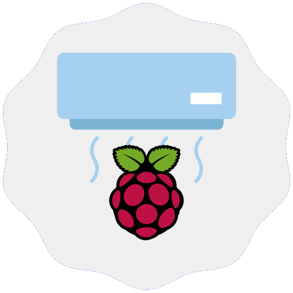

<p align="center">
  
  <h1 align="center">Cooler Trigger</h1>
</p>

### A little demonstration

#### When temperature > deactivation threshold


#### When temperature < activation threshold


### How did I get here?

If you don't want to know the evolution, you can go to **Getting Started**

I bought my Raspberry Pi and was concerned about heating it. So, I bought a USB cooler to cool the board. However, I would not like to leave it on forever. So, I would need a strategy to turn the cooler on and off

#### My first strategy

The first idea that came to mind was the use of cron jobs. I would turn the cooler on and off periodically via USB power on and off.

Some like this:

```bash
$ crontab -e
```

```
0,10,20,30,40,50 * * * * sudo uhubctl -a 1 -p 2 -l 1-1 -R
5,15,25,35,45,55 * * * * sudo uhubctl -a 0 -p 2 -l 1-1 -R
```

In my case, **every 5 minutes**, I turned the USB power on or off.

#### My current strategy

Currently, the strategy used by me is this application here. The **Cooler Trigger** monitors the **processor temperature** (SoC on the raspberry pi) and performs two side effects: activating the usb power when the temperature exceeds the deactivation threshold and deactivating the usb power when the temperature falls below the activation threshold.

According to [that article](https://linuxhint.com/raspberry_pi_temperature_monitor), **85 degrees Celsius should be the limit**.

> Officially, the Raspberry Pi Foundation recommends that the temperature of your Raspberry Pi device should be below 85 degrees Celsius for it to work properly.

But, I decided to set 65 degrees celsius as the cooler deactivation threshold to increase the card’s lifetime.

### Getting started

#### Requirements

* Raspberry Pi 3 B
* USB Cooler
* [uhubctl](https://github.com/mvp/uhubctl)
* Node.js / npm
* Git
* Internet :)

#### Cloning repo

```
$ git clone https://github.com/gabrielrufino/cooler-trigger
$ cd cooler-trigger
$ npm install
```
